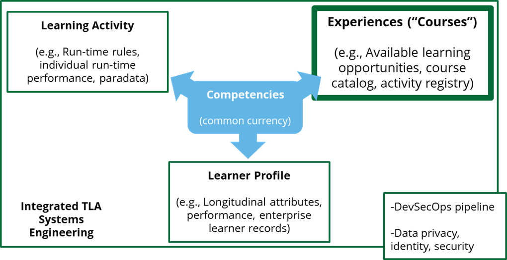
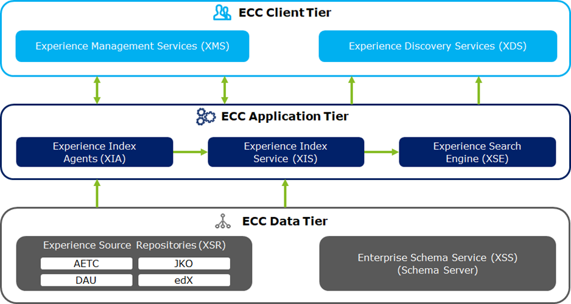
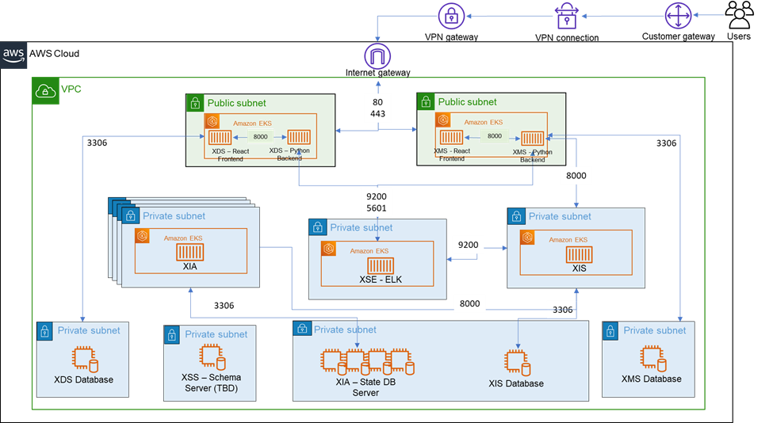

Welcome to OpenLXP!
OpenLXP uses a Micro-Services design to create a Learning Experience Platform (LXP).
The project is open source, to allow editing and customization to fit the needs of your organization.

# About
There are 4 main areas of the OpenLXP project:
* [XIA](Experience-Index-Agent-(XIA)) - where the experiences are indexed by agents.
* [XIS](Experience-Index-Service-(XIS)) - where the indexed experiences are stored.
* [XMS](Experience-Management-Service-(XMS)) - where the experience metadata can be manually edited.
* [XDS](Experience-Discovery-Service-(XDS)) - where the experiences can be discovered by end users.

The Enterprise Course Catalog (ECC) is a DoD-wide inventory of education and training assets that federate across local DoD networks and data sources, allowing personnel to use a single interface to access these resources, demonstrated in Figure 1 below. By providing a comprehensive catalog of online course content, the ECC will reduce duplications of effort for learners, training administrators, content developers, and acquisition personnel. ADL currently projects a heterogeneous mix of over 500 internal and external learning systems and environments, representing a near-corresponding amount of divergent learning experience metadata formats. An Enterprise Course Catalog should enable discovery of learning resources by DoD learners that enable access to these learning experiences and enable reporting of learning activities accomplished by such learners. 

 **Figure 1 - ADL ECC System Architecture Overview**

## ADL Enterprise Architecture
The ADL’s Total Learning Architecture (TLA) data strategy includes three functional pillars—information about specific runtime performance outcomes (Learning Activity), a description of the domain in general (Experiences), and individuals’ aggregate records and personal descriptors over time (Learner Profile) —connected via a fourth pillar (Competencies) that creates a “common currency” for semantic interoperability across the other pillars.

The current architectural goals are defined by the business objectives. Currently, siloed “course” or “experience” systems lead to various issues in accessing available learning opportunities and accessing course catalogs across organizational silos. This places the ECC’s scope squarely in the Experience pillar of the ADL’S TLA data strategy, highlighted in Figure 2 below. The business objective is to develop a portal that combines all of the local course catalogs across DoD into a single searchable director for greater accessibility at the time and place of need.

**Figure 2 - ADL TLA Data Strategy**

## ECC System Overview
The ECC is designed to offer flexibility in connecting to multiple source catalogs. Once invoked, the ECC Index Agents load the data into the Experience Index Service for a global search capability of ingested courses. Once the data has been stored within the XIS, data is pushed to Elasticsearch where high performance search engine is used to retrieve course data. Please refer to Figure 3 below for a visual representation of the components and connections comprising the ECC. While the figure depicts an AWS-hosted environment, the ECC can likely run on other major cloud providers (e.g., Azure, Google Cloud Platform) or on-premise environments with minor modifications.

**Figure 3 – ECC System Tiers**

**Figure 4 – ECC Infrastructure**

